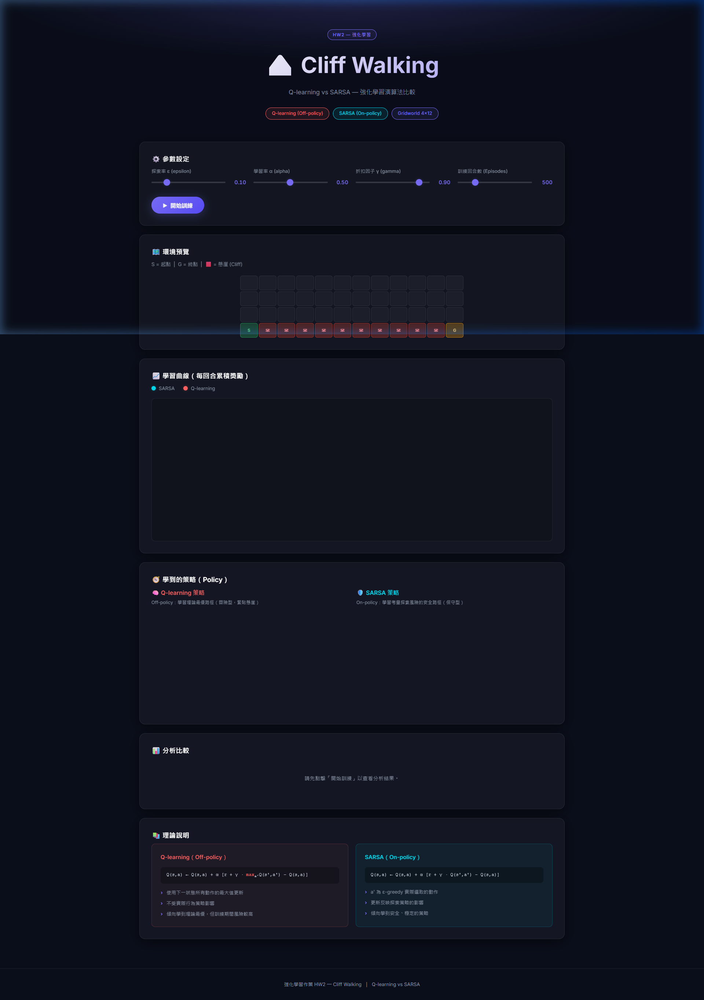
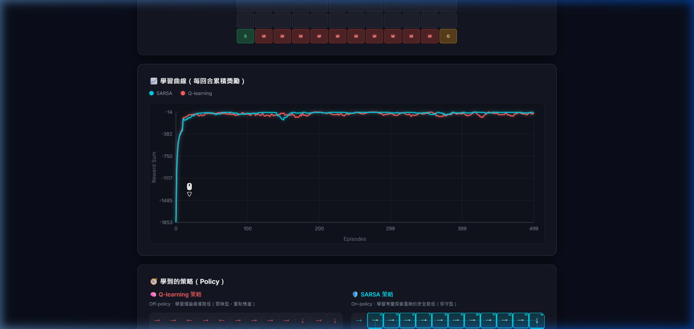
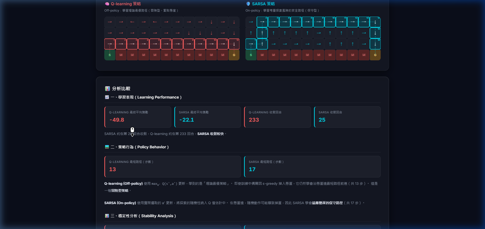

# 0415DRL_HW2 — Cliff Walking: Q-learning vs SARSA

[](https://v901203.github.io/0415DRL_HW2/)
[](https://v901203.github.io/0415DRL_HW2/)
[](https://v901203.github.io/0415DRL_HW2/)

互動式強化學習作業：比較 **Q-learning（Off-policy）** 與 **SARSA（On-policy）** 在 Cliff Walking 懸崖行走環境中的學習行為與策略差異。

---

## 🌐 Live Demo

**👉 [https://v901203.github.io/0415DRL_HW2/](https://v901203.github.io/0415DRL_HW2/)**

---

## 📸 預覽截圖

### 主頁面 — 參數設定與環境預覽


### 學習曲線圖


### 策略格子（Q-learning vs SARSA 路徑對比）


---

## 🏔️ 環境描述

| 項目 | 設定 |
|------|------|
| 網格大小 | 4 × 12 |
| 起點 (S) | 左下角 `(3, 0)` |
| 終點 (G) | 右下角 `(3, 11)` |
| 懸崖 (Cliff) | 底排，col 1–10 |
| 每步獎勵 | −1 |
| 掉入懸崖 | −100，回到起點 |
| 到達終點 | 回合結束 |

---

## 🤖 演算法說明

### Q-learning（Off-policy）

```
Q(s,a) ← Q(s,a) + α [r + γ · max_{a'} Q(s',a') − Q(s,a)]
```

- 使用下一狀態所有動作的最大 Q 值更新，與實際行為策略無關
- 學到**理論最優**（最短）路徑，緊貼懸崖邊行走（冒險型）

### SARSA（On-policy）

```
Q(s,a) ← Q(s,a) + α [r + γ · Q(s',a') − Q(s,a)]
```

- `a'` 為 ε-greedy 實際選取的下一步動作
- 學到**考量探索風險**的安全路徑，遠離懸崖（保守型）

---

## ⚙️ 參數設定

| 參數 | 預設值 | 說明 |
|------|--------|------|
| ε (epsilon) | 0.10 | ε-greedy 探索率 |
| α (alpha)   | 0.50 | 學習率 |
| γ (gamma)   | 0.90 | 折扣因子 |
| Episodes    | 500  | 訓練回合數 |

網頁介面提供滑桿即時調整以上所有參數。

---

## 📈 結果分析

| 指標 | Q-learning | SARSA |
|------|-----------|-------|
| 更新規則 | `max Q(s',a')` Off-policy | `Q(s',a')` On-policy |
| 路徑類型 | 緊貼懸崖（冒險型，步數少） | 遠離懸崖（保守型，步數多） |
| 訓練期獎勵 | 較低（常掉崖） | 較高（較安全） |
| 波動程度 | σ 較大 | σ 較小 |

---

## 🛠️ 技術架構

- **HTML5** — 語意化頁面結構
- **CSS3** — 暗色 Glassmorphism 主題、響應式版面
- **JavaScript (ES6+)** — 強化學習演算法、Canvas 圖表、格子策略視覺化

---

## 🚀 本地執行

直接用瀏覽器開啟 `index.html` 即可，無需安裝任何套件：

```bash
git clone https://github.com/v901203/0415DRL_HW2.git
cd 0415DRL_HW2
# Windows
start index.html
```

---

## 📚 參考資料

- Sutton & Barto, *Reinforcement Learning: An Introduction*, 2nd Ed., Chapter 6
- [Reference Implementation](https://github.com/enwu03/0415DRL_HW2)
